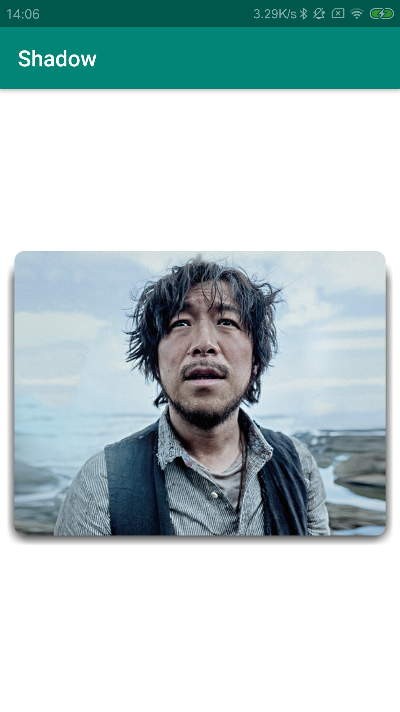
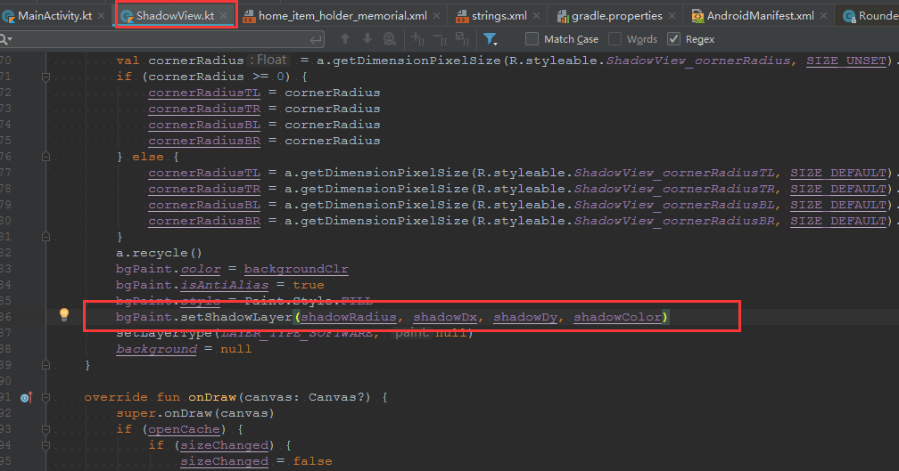

# Shadow
### 首先，上效果图：<br/>

<br/>

### 实现的关键代码：
<br/>
其实就是给画笔设置阴影效果，然后绘制一个跟图片一样大的Bitmap

参考了别人已经写好的[轮子](https://github.com/loopeer/shadow)，刚开始用的时候感觉还行，但是我一放到RecyclerView中时，滑动会有明显的卡顿，所以优化了一下
### 优化点：
1. 将ShadowView用自定义ViewGroup改为View，触发重绘制的时机减少，重绘制所花费的时间更少<br/>

2. <b>减少绘制的Bitmap大小</b>
```
// Bitmap.Config.ALPHA_8只保留透明度，因为现在的阴影是黑色，所以可以使用，用以降低Bitmap的大小
cacheBitmap = Bitmap.createBitmap(measuredWidth, measuredHeight, Bitmap.Config.ALPHA_8)

// AndroidManifest.xml
android:largeHeap="true" // 开启最大堆
```
最开始用的是Bitmap.Config.ARGB_8888，每一个像素点用4byte来存储色彩和透明度信息，然后悲剧就发生了，滑动RecyclerView时，OOM<br/>
所以后面改成了Bitmap.Config.ALPHA_8，每一个像素点用1byte来存储透明度信息，相比于Bitmap.Config.ARGB_8888，大小为其的四分之一

3. 利用RecyclerView的item复用，减少重复绘制
```
    override fun onDraw(canvas: Canvas?) {
        super.onDraw(canvas)
        if (openCache) {
            if (sizeChanged) { // View的大小有改变时，重新绘制Bitmap
                sizeChanged = false
                try {
                    // Bitmap.Config.ALPHA_8只保留透明度，因为现在的阴影是黑色，所以可以使用，用以降低Bitmap的大小
                    cacheBitmap = Bitmap.createBitmap(measuredWidth, measuredHeight, Bitmap.Config.ALPHA_8)
                    drawShadow(Canvas(cacheBitmap))
                } catch (e: OutOfMemoryError) {
                    Log.e(ShadowView::class.java.simpleName, "OutOfMemoryError: " + e.message)
                }
            }
            cacheBitmap?.let {
                canvas?.drawBitmap(cacheBitmap, 0F, 0F, Paint())
            }
        } else {
            drawShadow(canvas)
        }
    }


    override fun onSizeChanged(w: Int, h: Int, oldw: Int, oldh: Int) {
        super.onSizeChanged(w, h, oldw, oldh)
        sizeChanged = true
    }
```

圆满完成，工作遇到的问题，记录下
<br/>
<br/>
<br/>

@copy;Copyright: 爱穿衬衫的程序员